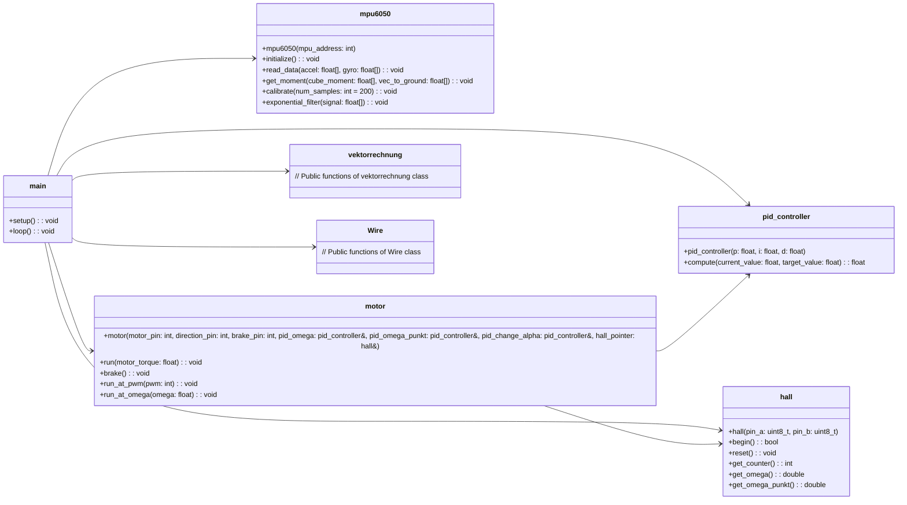

# Dokumentation des Würfels
## Inhaltsverzeichnis
- Klassendiagramm
- Teileliste
- Pinbelegung
- Erklärungen zum Code
## Klassendiagramm

## Teileliste
| Teil | Anzahl | Preis pro Stück (ungefähr)| Link |
|--|--|--|--|
| Nidec24h Motor | 3 | 7€ |  |
| 20kg Digital Servo Miuzei | 3 | 13€ | https://www.amazon.de/dp/B0BV6HQF2X?psc=1&ref=ppx_yo2ov_dt_b_product_details |
| Step down converter | 1 | insg. 9€ | https://www.amazon.de/LM2596S-ADJ-Module-Regulator-Einstellbares-Convert/dp/B07XT8C3BK/ref=sr_1_8?crid=2AIN5LA811MAY&keywords=step+down+converter&qid=1689949900&sprefix=step+do%2Caps%2C110&sr=8-8 |
| Lochplatine mit Standfüßchen | 1 | insg. 14€ | https://www.amazon.de/dp/B08TMMZPWT?psc=1&ref=ppx_yo2ov_dt_b_product_details |
| ESP32 | 1 | 10€ | https://www.az-delivery.de/products/esp32-developmentboard |
| Kugellager | 27 | 0,5€ | https://www.amazon.de/dp/B09PVDDBWF?psc=1&ref=ppx_yo2ov_dt_b_product_details |
| M3 Schrauben Set | 1 | 20€ | https://www.amazon.de/dp/B083R4PKBW?psc=1&ref=ppx_yo2ov_dt_b_product_details |
| Gewindeeinsätze | ca. 40 | insg. 6€ | https://www.amazon.de/dp/B0BS3LH9K9?psc=1&ref=ppx_yo2ov_dt_b_product_details |
| MPU6050 | 1 | 13€ | https://www.amazon.de/dp/B07NP2WF7J?psc=1&ref=ppx_yo2ov_dt_b_product_details |
| Bremsbeläge | 3x2 | 16€ | https://www.amazon.de/dp/B07THYX7SZ?psc=1&ref=ppx_yo2ov_dt_b_product_details |

## Pinbelegung
- noch frei:
    - 33
    - 34
- Motor 1: 
    1. 12/24V
    2. GND
    3. Start/Stop 25
    4. PWM 26
    5. Direction 27
    6. Encoder Power (5V)
    7. Encoder Pin A 35
    8. Encoder Pin B 32
- Motor 2: 
    1. 12/24V
    2. GND
    3. Start/Stop 14
    4. PWM 12
    5. Direction 13
    6. Encoder Power (5V)
    7. Encoder Pin A SD2 (muss noch schauen, ob das geht)
    8. Encoder Pin B SD3 (muss noch schauen, ob das geht)
- Motor 3: 
    1. 12/24V
    2. GND
    3. Start/Stop 17
    4. PWM 0
    5. Direction 4
    6. Encoder Power (5V)
    7. Encoder Pin A 2
    8. Encoder Pin B 15
- Servo 1:
    1. GND
    2. 5V
    3. Signal 19
- Servo 2:
    1. GND
    2. 5V
    3. Signal 18
- Servo 3:
    1. GND
    2. 5V
    3. Signal 5
- MPU6050
    1. 3.3 V
    2. GND
    3. SCL 22
    4. SDA 21
## Erklärung zum Code
Um die main möglichst lesbar zu behalten wurden alle Klassen in seperaten Header files initialisiert und deklariert. Zudem werden die globalen Variablen in dem Header file globals.h initialisiert und alle globalen Strukturen (Structs und Objekte) in der Datei globals.cpp deklariert.  
Wir haben Folgende Klassen: 
### hall.h  
In dieser Klasse wird aus dem Signal der Hall Sensoren die Drehzahl und die Drehbeschleunigung der Schwungscheibe bestimmt. Diese erlaubt es uns die Leistung, welche der Motor aktuell ausgibt zu bestimmen, da wir die Trägheit der Scheibe wissen(konstant und durch Geometrie der Scheibe vorgegeben).
### mpu6050.h
In dieser Klasse wird aus den Messwerten des MPU6050 Sensors(Beschleunigung und Drehbeschleunigung in x,y,z Richtung) der Drehmoment, welcher auf den Würfel durch die Gravitation wirkt berechnet. Dieser kommt einfach aus dem Kreuzprodukt aus dem Gravitationsvektor mit dem Verbindungsvektor von Schwerpunkt zum Boden-Kontaktpunkt(sowie einigen konstanten Faktoren wie Gravitationsbeschleunigung, Masse des Würfels und Kantenlänge des Würfels). 
### servo.h
Diese Klasse hat die einfache Aufgabe die Ovale Scheibe in die geschlossenen und der offenen Bremsstellung zu bewegen. Dazu wird die ESP32Servo libary eingebunden. Anschließend wird in der Klasse ein Objekt Servo aus der Libary erstellt. Zudem beinhaltet die Klasse zwei öffentliche Funktionen: Eine zum öffnen und eine zum schließen der Bremse. 
### motor.h
Diese Klasse ist beinhaltet die Funktionen zum kontrollieren der Nidec24h Motoren. Die grundlegende Methode ist die run_at_PWM Methode. Auf diese aufbauend gibt es die Methode run at Omega, welche mithilfe von mithilfe der Hall Sensoren die aktuelle Drehgeschwindigkeit ausliest und anschließend diese den Motor so ansteuert, dass er bis zu dieser Geschwindigkeit ansteuert. Außerdem beinhaltet die Klasse motor eine Funktion run. Diese wird zum balancieren auf einer Kante oder einer Funktion genutzt. Als Eigabe erhält diese Methode einen Drehmoment, welchen der Motor probiert auf die Schwungscheibe zu wirken. Bei der Umwandlung des Moments in einen PWM Wert nutzt die Motor Klasse einen PID Regler. 
### pid.h
Diese Klasse enthält den PID Controller. Dabei ist die wichtigste Methode die compute methode, welche aus einem gegebenen Input und einem angestrebten Target einen Wert gibt. Die pid-Werte ewrden beim erstellen des Objekts als private Attribute gespeichert. 