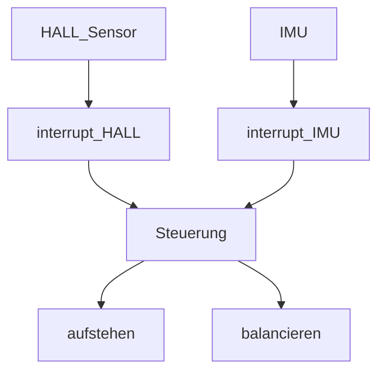
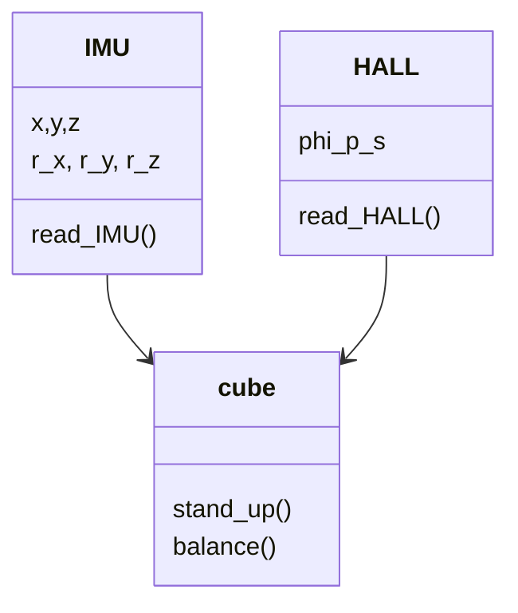
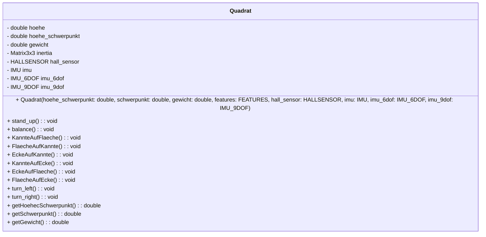
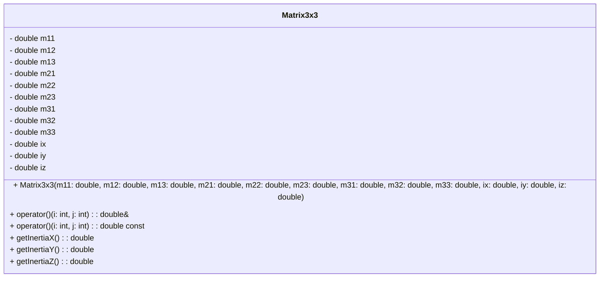
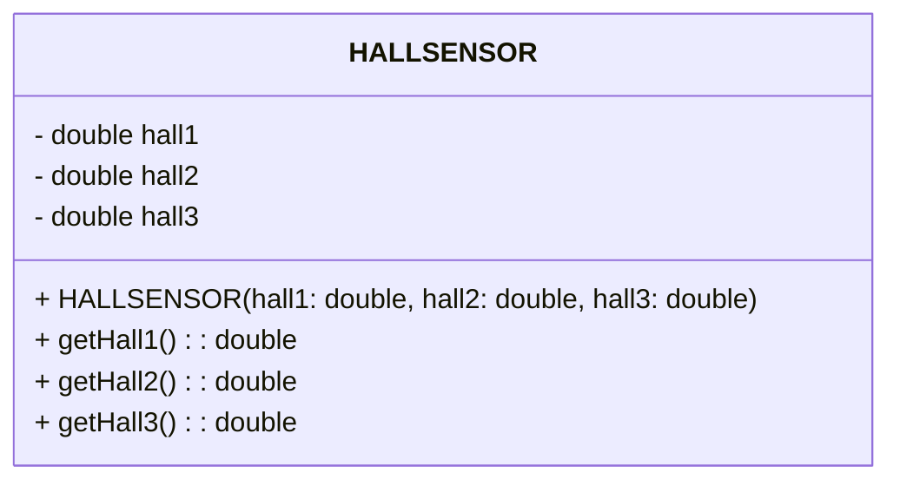
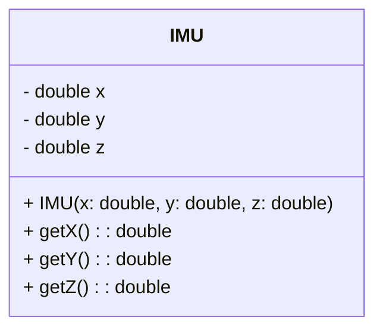
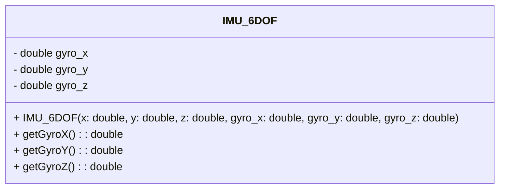
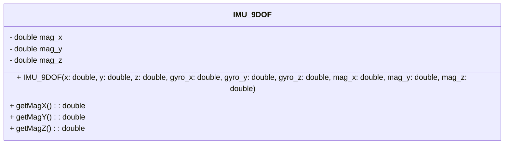

# Dies ist die Dokumentation zu dem Code des Quadrats

## Code Stuktur
Die Funkitonalität des Codes ist wie folgt unterteilt:

Hier ein Klassendiagramm um zu zeigen, welche Klassen ich nutze

